# 📈 Mock BSE Internal Portal


A full-stack **Employee–Client–Trade Management System** built using **Spring Boot**, **React**, **MySQL**, and **Server-Sent Events (SSE)**.

This project simulates an internal brokerage portal where employees manage clients, their stock market trades, and incentives. It also includes a **Mock BSE API** that behaves like a real external stock exchange by introducing configurable delays, random failures, and real-time updates using Server-Sent Events.

---

## 🚀 Built With

- Java
- Spring Boot
- Spring Data JPA
- Hibernate
- React
- React Router
- Axios
- MySQL
- Bootstrap
- Bootstrap Icons
- Maven
- Server-Sent Events (SSE)

---

# ✨ Features

## 👨 Employee Management

- Add Employee
- Update Employee
- Delete Employee
- View Employees
- Pagination
- Sorting

---

## 👥 Client Management

- Add Client
- Update Client
- Delete Client
- View Clients
- Pagination
- Sorting

---

## 📈 Trade Management

- Add Trade
- Update Trade
- Delete Trade
- View Trades
- Filter by Client
- Filter by Date Range
- Pagination
- Sorting

---

## 🤝 My Clients

View all clients assigned to a selected employee.

---

## 💹 My Trades

View all trades belonging to the clients assigned to a selected employee.

---

## 💰 Incentive Calculation

Calculate employee incentives based on brokerage earned from client trades.

---

## ☁️ Deployment

- Frontend deployed on Vercel
- Backend deployed on Render
- Live full-stack application

---

# ⚙️ Tech Stack

## Backend

- Java
- Spring Boot
- Spring Data JPA
- Hibernate
- Lombok
- Maven

---

## Frontend

- React
- React Router
- Axios
- Bootstrap
- Bootstrap Icons

---

## Database

- MySQL

---

# 🏗️ System Architecture

```text
                  React Frontend
                        │
                 Axios HTTP Requests
                        │
              Spring Boot REST APIs
                        │
          ┌─────────────┴─────────────┐
          │                           │
     MySQL Database            Mock BSE Service
                                      │
                         Artificial Delay
                         Random Failure
                     Server-Sent Events (SSE)
```

---

# 📂 Project Structure

```text
fullstack_mock_bse
│
├── mock-bse-api
│   ├── config
│   ├── controller
│   ├── dto
│   ├── entity
│   ├── exception
│   ├── mapper
│   ├── repository
│   ├── service
│   ├── sse
│   └── util
│
├── mock-bse-ui
│   ├── api
│   ├── components
│   ├── pages
│   ├── services
│   └── assets
│
├── screenshots
│
└── README.md
```

---

# 📡 REST APIs

## Employee APIs

- Get Employees
- Get Employee By Id
- Add Employee
- Update Employee
- Delete Employee

---

## Client APIs

- Get Clients
- Get Client By Id
- Add Client
- Update Client
- Delete Client

---

## Trade APIs

- Get Trades
- Get Trade By Id
- Add Trade
- Update Trade
- Delete Trade

---

## Employee Operations

- My Clients
- My Trades
- Incentives

---

## Mock BSE APIs

- Get Mock BSE Clients
- Get Mock BSE Trades
- Sync Mock BSE Data
- SSE Events Endpoint

---

# 📡 Server-Sent Events (SSE)

The project uses **Server-Sent Events (SSE)** to simulate real-time communication between the backend and the React frontend.

### Workflow

1. React subscribes to the SSE endpoint.
2. User triggers **BSE Sync**.
3. Backend simulates network delay.
4. Backend randomly succeeds or fails.
5. On success, an SSE event is broadcast.
6. React automatically refreshes the Mock BSE pages without manually refreshing the browser.

---

# 🏦 Mock BSE Simulation

The Mock BSE API is designed to imitate the behaviour of an external stock exchange API.

Features include:

- Configurable response delay
- Random API failures
- Retry functionality
- Loading indicators
- Automatic refresh after successful synchronization
- Real-time communication using SSE

---


# 📷 Screenshots

> **Note:** The following screenshots were taken from the local development environment for consistency. The project has been successfully deployed and can be accessed through the live links in the **Live Demo** section.

## Dashboard

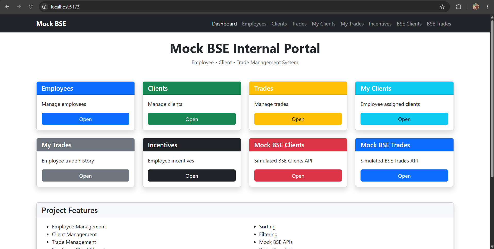

---

## Employees

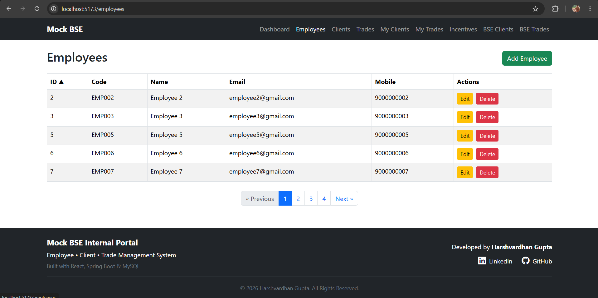

---

## Clients

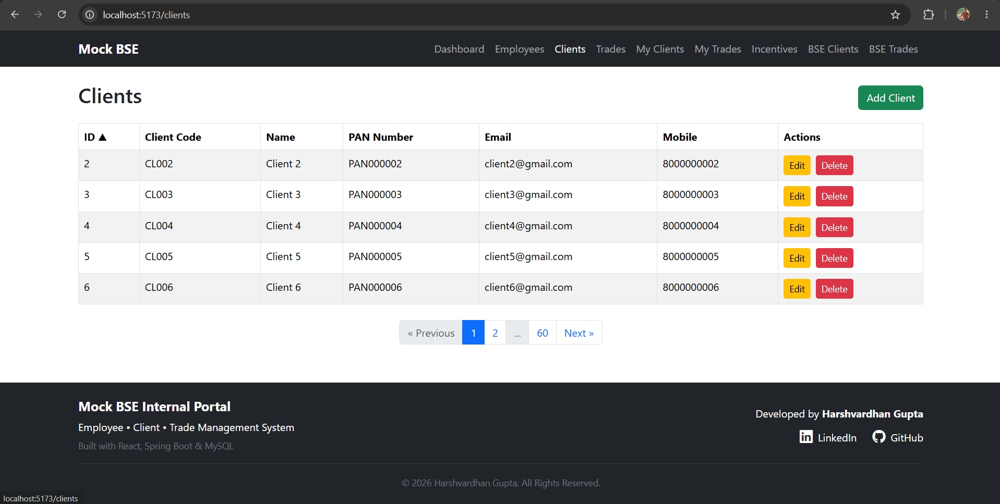

---

## Trades

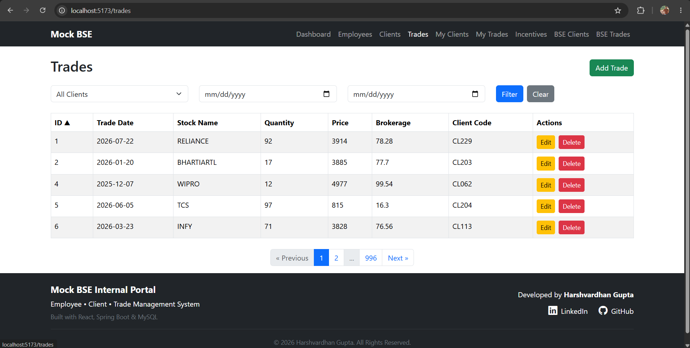

---

## My Clients

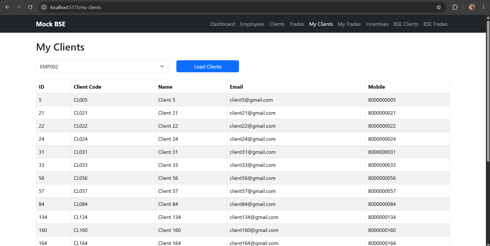

---

## My Trades

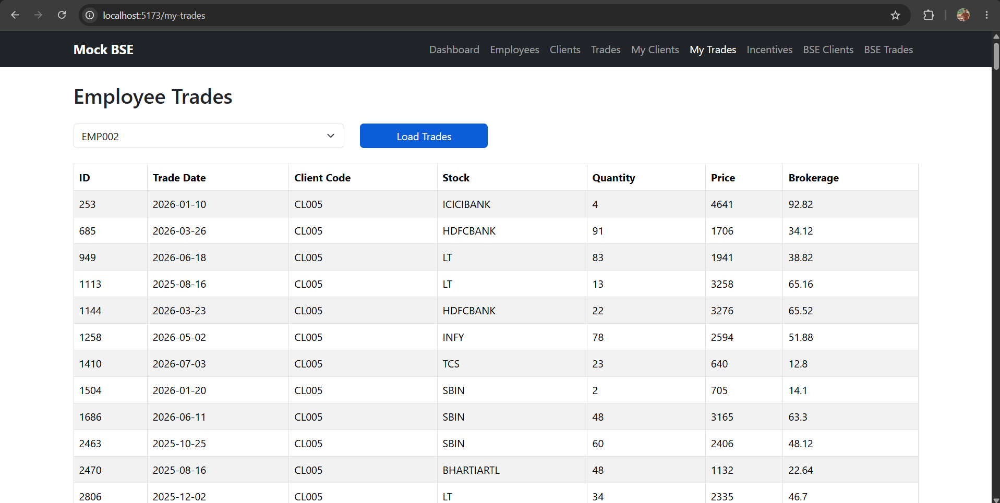

---

## Incentives

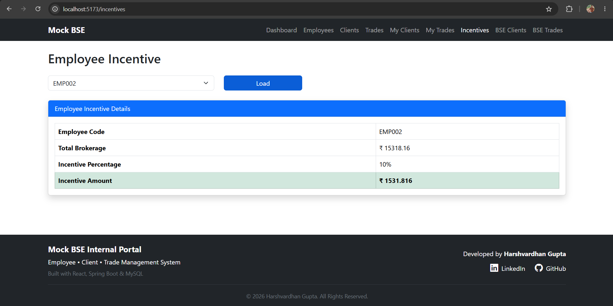

---

## Mock BSE Clients

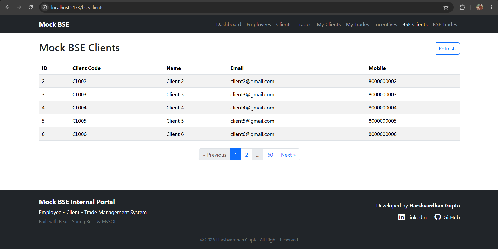

---

## Mock BSE Clients Loading

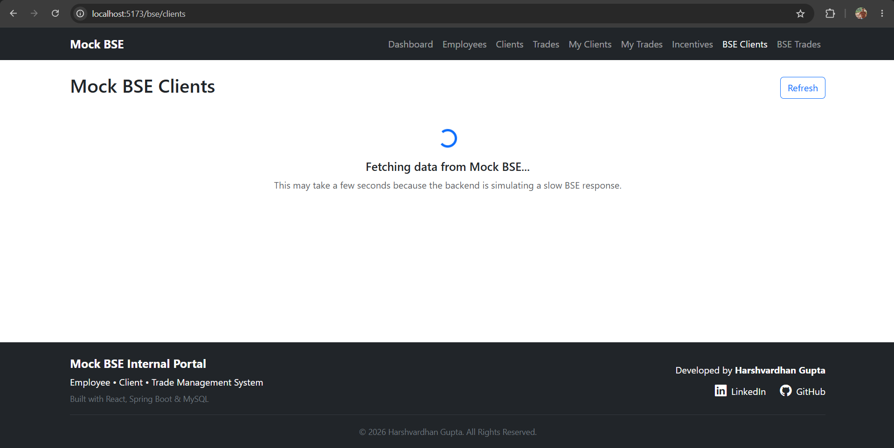

---

## Mock BSE Clients Error

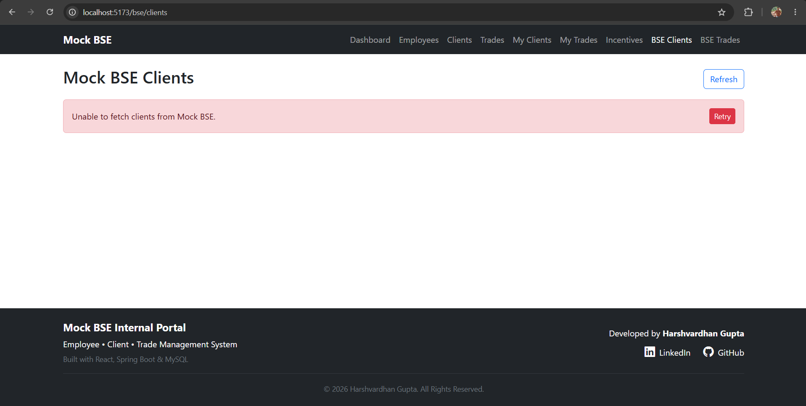

---

## Mock BSE Trades

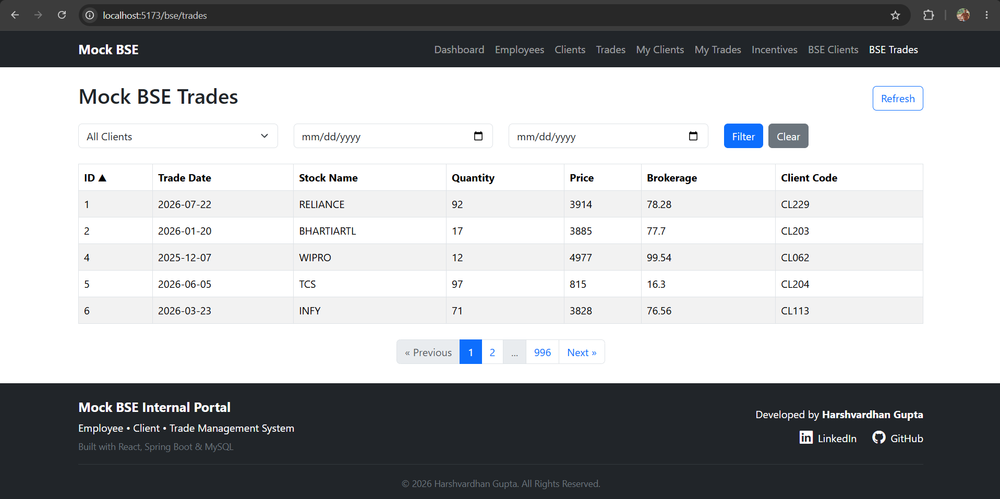

---

## Mock BSE Trades Loading

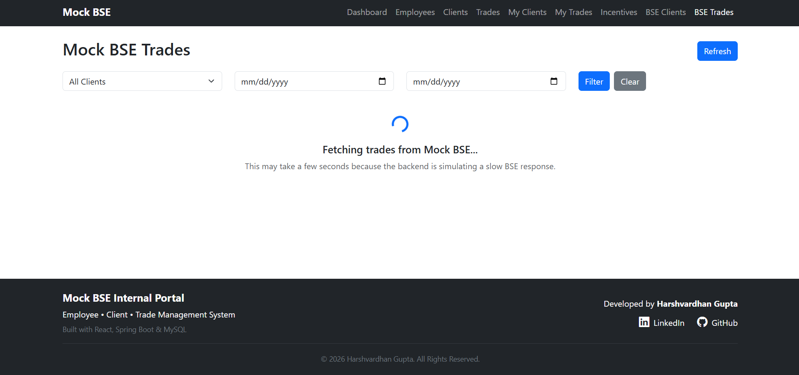

---

## Mock BSE Trades Error

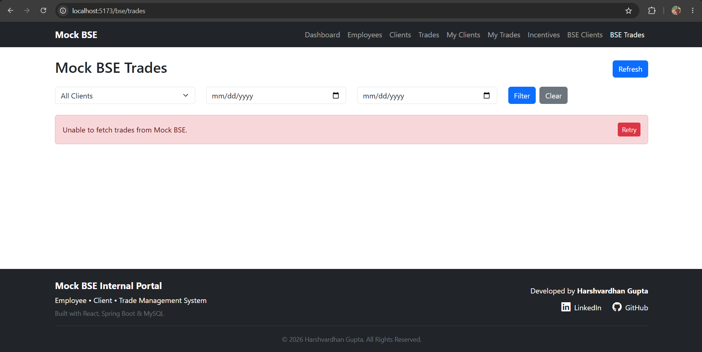

---

# 💻 Installation

## Prerequisites

Before running the project, make sure you have the following installed:

- Java 21
- Maven
- MySQL
- Node.js
- npm

## Clone Repository

```bash
git clone https://github.com/harshgupta73/fullstack-mock-bse.git
```

---

## Backend Setup

Navigate to the backend project.

```bash
cd mock-bse-api
```

Create a MySQL database named:

```sql
CREATE DATABASE mock_bse_api;
```

Update your database credentials in:

`src/main/resources/application.properties`

Example:

```properties
spring.datasource.url=jdbc:mysql://localhost:3306/mock_bse_api
spring.datasource.username=YOUR_USERNAME
spring.datasource.password=YOUR_PASSWORD
```

Run the Spring Boot application using your IDE or:

```bash
mvn spring-boot:run
```

---

## Frontend Setup

Navigate to the frontend project.

```bash
cd mock-bse-ui
```

Install dependencies.

```bash
npm install
```

Run the React application.

```bash
npm run dev
```

---

# 🌐 Live Demo

## Frontend

https://fullstack-mock-bse.vercel.app

---

## Backend

The backend is a REST API built with Spring Boot. Visiting the root URL directly returns a **404 (Whitelabel Error Page)** because no homepage is configured.

You can test the backend using the API endpoints below.

Base URL:

https://fullstack-mock-bse.onrender.com

### Example Endpoints

GET Employees

https://fullstack-mock-bse.onrender.com/employees

GET Clients

https://fullstack-mock-bse.onrender.com/clients

GET Trades

https://fullstack-mock-bse.onrender.com/trades

GET Mock BSE Clients

https://fullstack-mock-bse.onrender.com/bse/clients

GET Mock BSE Trades

https://fullstack-mock-bse.onrender.com/bse/trades

---

# 🎯 Future Improvements

- Spring Security with JWT Authentication
- Role-Based Authorization
- Docker Containerization
- Unit Testing
- Integration Testing
- Kafka Event Streaming
- WebSocket Support
- Dashboard Analytics
- Charts & Reports
- Excel/PDF Export
- Cloud Deployment

---

# 👨‍💻 Author

**Harshvardhan Gupta**

- GitHub: https://github.com/harshgupta73
- LinkedIn: https://linkedin.com/in/harshvardhan-gupta-b10308397

---

## ⭐ If you found this project useful, consider giving it a Star on GitHub!